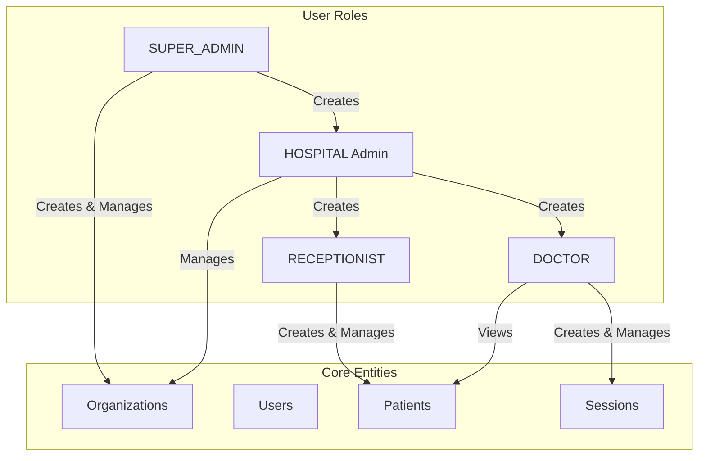
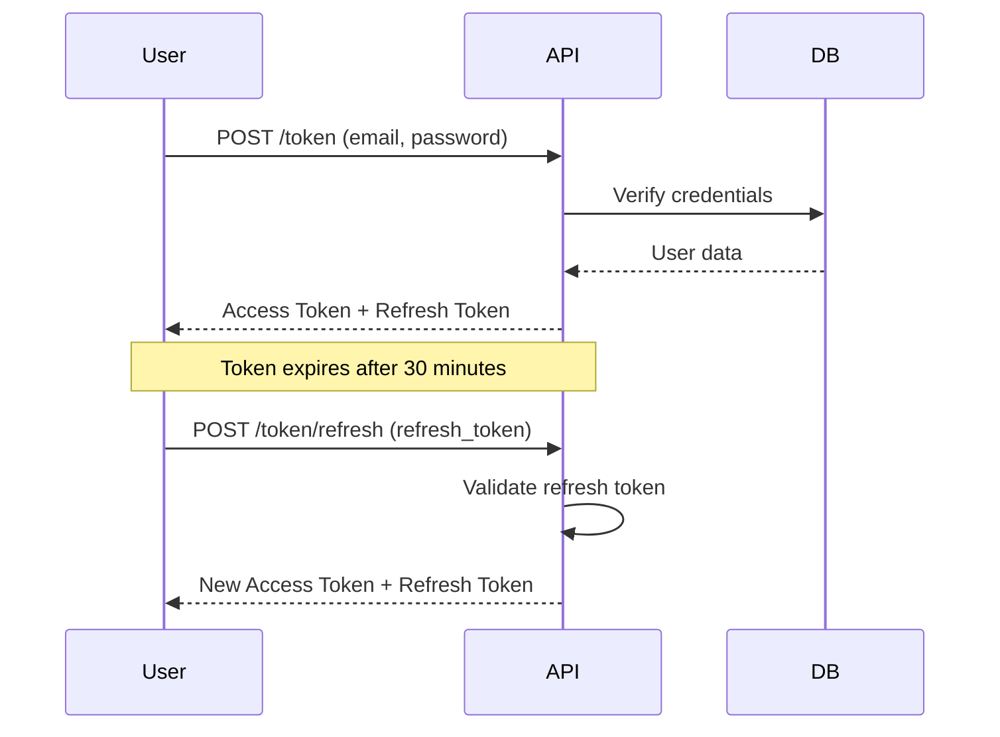
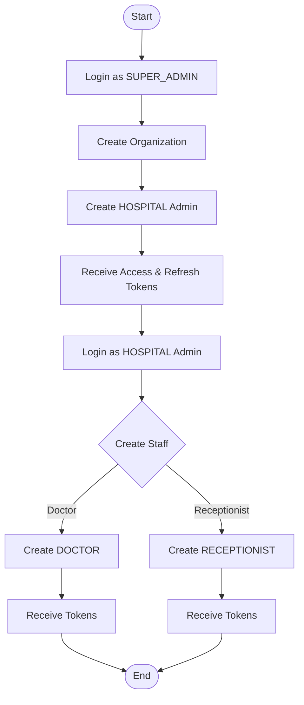
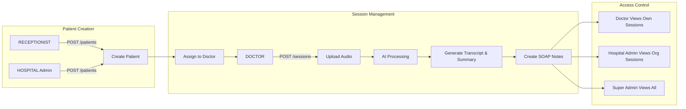
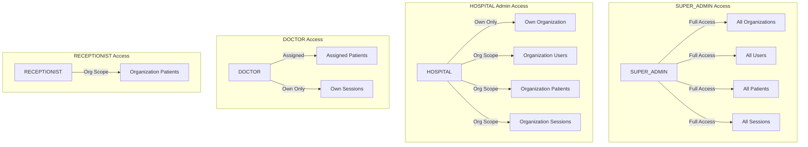
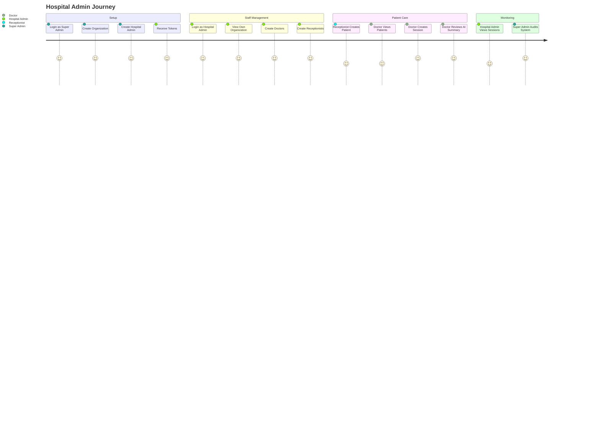
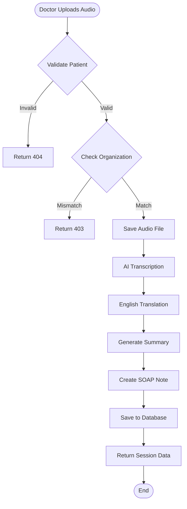
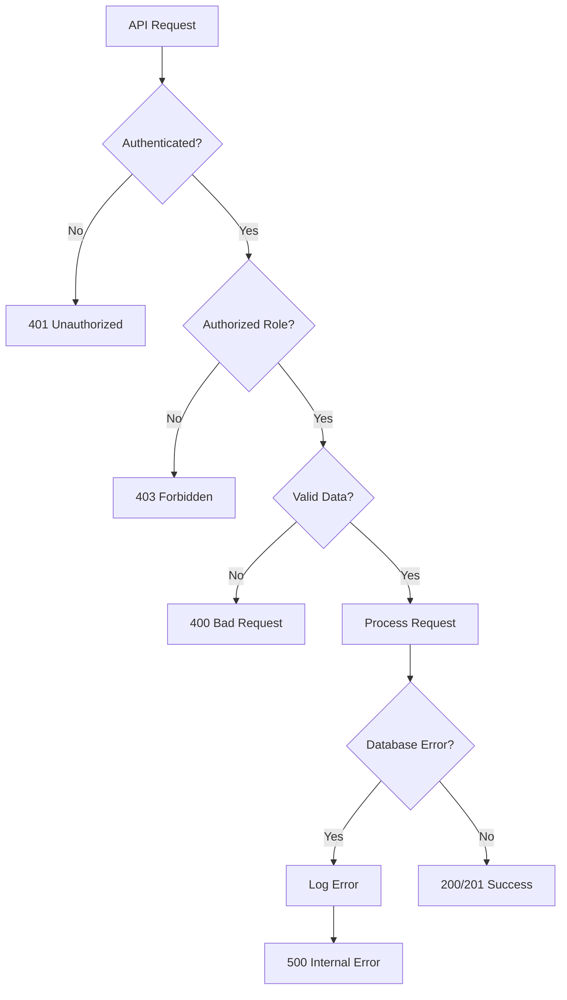

# PsycheGraph System Workflow

## System Architecture Overview

## Authentication Flow

## User Creation Workflow

## Patient & Session Management

## Data Access Permissions

## API Endpoint Access Matrix

| Endpoint | SUPER_ADMIN | HOSPITAL | DOCTOR | RECEPTIONIST |
|----------|-------------|----------|--------|--------------|
| **Organizations** |
| GET /organizations/ | All | Own Only | ❌ | ❌ |
| GET /organizations/{id} | Any | Own Only | ❌ | ❌ |
| POST /organizations | ✅ | ❌ | ❌ | ❌ |
| **Users** |
| GET /users/ | All | Org Only | ❌ | ❌ |
| POST /users | ✅ | Doctors/Receptionists | ❌ | ❌ |
| **Patients** |
| GET /patients/ | All | Org Only | Org Only | Org Only |
| POST /patients/ | ✅ | ✅ | ❌ | ✅ |
| **Sessions** |
| GET /sessions/ | All | Org Only | Own Only | ❌ |
| POST /sessions/ | ❌ | ❌ | ✅ | ❌ |

## Complete User Journey

## Session Processing Pipeline

## Error Handling Flow

